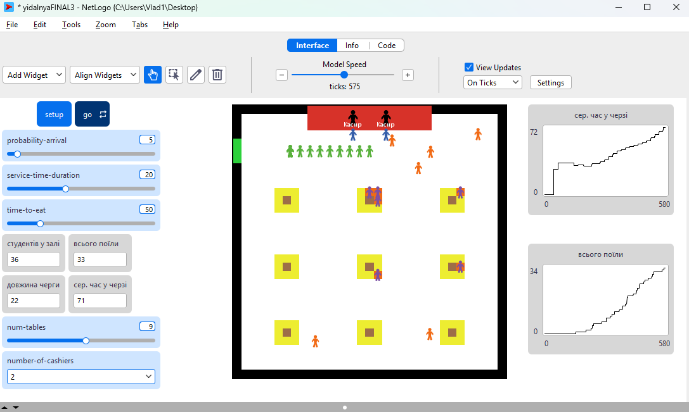

## Комп'ютерні системи імітаційного моделювання
## СПм-24-4, **Почуєнков В.І., Погуляй Д.О.**
### Домашнє завдання. Імітаційна модель їдальні університету

 

### Вербальний опис моделі:
Модель їдальні університету призначена для імітації та аналізу потоку відвідувачів у закладі харчування. Вона демонструє процес обслуговування студентів, починаючи від їх появи та очікування в черзі, закінчуючи прийомом їжі та виходом із системи. Агенти-студенти з'являються з певною ймовірністю і стають у загальну чергу. Агенти-касири (staff) обслуговують першого студента з черги, що займає певний час (оформлення замовлення). Після обслуговування студент переходить у стан пошуку вільного місця. Пошук місця реалізовано як випадкове блукання залом, доки агент не знайде вільну ділянку типу "стілець" поруч зі "столом". Зайнявши місце, студент проводить там фіксований час (їсть), після чого звільняє стілець і зникає з моделі (покидає їдальню). Модель дозволяє оцінити пропускну здатність їдальні, завантаженість касирів та середній час очікування в черзі залежно від кількості столів та швидкості обслуговування.

### Керуючі параметри:
- **PROBABILITY-ARRIVAL** Ймовірність (у відсотках від 0 до 100) появи групи нових студентів на кожному такті модельного часу.
- **NUMBER-OF-CASHIERS**  Кількість активних касирів, що працюють одночасно.
- **SERVICE-TIME-DURATION** Кількість тактів, необхідна касиру для обслуговування одного студента (прийняття замовлення).
- **NUM-TABLES** Кількість столів, що розміщуються в залі при налаштуванні світу (кожен стіл генерує навколо себе стільці).
- **TIME-TO-EAT**  Кількість тактів, яку студент проводить за столом (тривалість прийому їжі).

### Внутрішні параметри:
- **State**  Поточний стан студента, який визначає його поведінку: "queuing" (у черзі), "ordering" (замовляє), "searching" (шукає місце), "eating" (їсть).
- **Queue-list**  Глобальний список, що зберігає черговість агентів-студентів, які очікують на обслуговування.
- **Arrival-tick**  Час (номер такту), коли студент з'явився в системі; використовується для розрахунку часу очікування.
- **Staff-timer**  Лічильник часу у касира, який відраховує такти до завершення обслуговування поточного клієнта.
- **Eating-timer**  Лічильник часу у студента, що відраховує час до завершення трапези.
- **Is-chair? / Is-table? / Is-counter?**  Логічні змінні ділянок поля (patches), що визначають топологію їдальні (місця для сидіння, столи, зона кас).

### Показники роботи системи:
**Лічильники, що показують:** 
- Скільки всього студентів у залі
- Довжину черги
- Скільки всього студентів поїли
- Середній час у черзі  
**Графіки, що показують:**
- Скільки студентів встигли поїсти
- Середній час очікування у черзі

### Примітки:
- Черга реалізована програмно як список (queue-list), але візуально агенти намагаються вишукуватися в лінію, розраховуючи координати на основі своєї позиції в списку.
- Касири працюють паралельно: кожен вільний касир перевіряє загальну чергу і забирає першого доступного студента.
- Студенти вважаються "нагодованими" (fed) тільки після того, як вони відсиділи визначений час за столом, а не одразу після каси.

 

**1. Оголошення агентів та змінних**  
Ця частина визначає структуру даних моделі.
<pre>
breed [students student]
breed [staff a-staff]

globals [
  queue-list           ; Спільна черга (список агентів)
  
  ; Статистика
  total-queue-time     ; Загальний час очікування всіх студентів
  count-served-students; Кількість студентів, що пройшли касу
  students-fed         ; Кількість студентів, що поїли і пішли
]

students-own [
  state                ; Поточний стан: "queuing", "ordering", "searching", "eating"
  arrival-tick         ; Час появи (для підрахунку очікування)
  eating-timer         ; Час, що залишився на їжу
  my-cashier           ; Посилання на касира, який обслуговує
]

staff-own [
  staff-timer          ; Час до завершення обслуговування поточного клієнта
  staff-customer       ; Посилання на студента, якого обслуговують зараз
]

patches-own [          ; Властивості ділянок поля
  is-counter?          
  is-chair?            
  is-table?            
  is-wall?             
]
</pre>  
- Створюються два види агентів: students (відвідувачі) та staff (касири).
- Оголошуються глобальні змінні для черги та статистики.
- Кожен агент та ділянка (patch) отримують власні змінні. Наприклад, патчі знають, чи є вони стіною, столом або стільцем, а студенти знають свій поточний стан.

**2. Ініціалізація світу (setup)**  
Головна процедура запуску.
<pre>
to setup
  setup-map 
  reset-round
  setup-staff
end
</pre>  
- Викликає допоміжні процедури: малювання карти (setup-map), скидання лічильників (reset-round) та створення персоналу (setup-staff).

**3. Малювання мапи та меблів (setup-map)**  
<pre>
to setup-map
  no-display
  clear-all 
  
  ; Очищення та фон
  ask patches [ 
    set pcolor white 
    set is-chair? false   
    ... 
  ] 
  
  ; 1. Стіни (кордони світу)
  ask patches with [ ... ] [ set pcolor black set is-wall? true ]
  
  ; 2. Зона кас
  ask patches with [ pycor > max-pycor - 3 and abs pxcor < 8 ] [ ... set is-counter? true ]

  ; 3. Вхід
  ask patch min-pxcor (max-pycor - 5) [ ... set is-wall? false ... ]
  
  ; 4. Столи (алгоритм розміщення)
  if num-tables > 0 [
    ; Розрахунок сітки (рядки та колонки) для рівномірного розміщення столів
    let cols ceiling sqrt num-tables          
    let rows ceiling (num-tables / cols)      
    ...
    while [tables-created < num-tables] [
      ; Визначення координат та малювання столу (коричневий) і стільців навколо (жовті)
      ask target-patch [
        set pcolor brown
        set is-table? true
        ask neighbors [          ; Сусідні 8 патчів стають стільцями
          if not is-wall? [ 
            set pcolor yellow 
            set is-chair? true 
          ]
        ]
      ]
      ...
    ]
  ]
  display
end

</pre>  
- Очищає поле.
- Малює стіни по периметру.
- Створює зону кас і вхід.
- **Логіка столів:** Автоматично розраховує, як розмістити задану кількість столів (num-tables) рівномірною сіткою. Кожен стіл перетворює 8 своїх сусідніх патчів на стільці.

  **4. Створення персоналу (setup-staff)**  
<pre>
to setup-staff
  ask staff [ die ]
  let n number-of-cashiers
  create-staff n [
    set shape "person"
    set color black
    ...
    ; Розрахунок позиції, щоб касири стояли в ряд за прилавком
    let spacing 4 
    let start-x 0 - ( (n - 1) * spacing / 2 )
    setxy (start-x + (my-pos-index * spacing)) (max-pycor - 1)
  ]
end
</pre>  
- Видаляє старих касирів і створює нових відповідно до налаштувань інтерфейсу.
- Рівномірно розставляє їх за червоною лінією прилавку.

**5. Головний цикл (go)**  
Ця процедура виконується на кожному кроці (тіку).
<pre>
to go
  ; 1. Генерація нових студентів
  if random 100 < probability-arrival [
    create-students (1 + random 3) [
      ...
      set state "queuing"               ; Початковий стан - черга
      set queue-list lput self queue-list ; Додавання в кінець списку черги
      ...
    ]
  ]
  
  ; 2. Логіка роботи касирів
  handle-service-multi
  
  ; 3. Логіка поведінки студентів
  ask students [ student-behavior ]
  
  tick
end
</pre>  
- З певною ймовірністю створює нових студентів, одразу додаючи їх у глобальний список черги (queue-list).
- Запускає процедуру обслуговування (касири).
- Запускає процедуру поведінки (рух студентів).
- Просуває час уперед (tick).

**6. Обслуговування (handle-service-multi)**  

<pre>
to handle-service-multi
  ask staff [
    ; Якщо касир вільний
    if staff-timer = 0 [
      if not empty? queue-list [
        let next-student first queue-list ; Беремо першого з черги
        
        ; Перевірка, чи студент фізично дійшов до каси
        ask next-student [ if distancexy ... < 2 [ set ready? true ] ]
        
        if ready? [
          set queue-list but-first queue-list ; Видаляємо з черги
          set staff-customer next-student
          
          ask next-student [
            set state "ordering"              ; Зміна стану студента
            set my-cashier myself 
            ; Статистика
            set total-queue-time total-queue-time + (ticks - arrival-tick)
          ]
          set staff-timer service-time-duration ; Встановлення таймера обслуговування
        ]
      ]
    ]
    
    ; Якщо обслуговування триває
    if staff-timer > 0 [
      set staff-timer staff-timer - 1
      if staff-timer = 0 ... [ ; Коли час вийшов
        ask staff-customer [
          set state "searching" ; Відпускаємо студента шукати місце
        ]
        set staff-customer nobody
      ]
    ]
  ]
end
</pre>  
- Касири перевіряють, чи є хтось у черзі.
- Якщо студент поруч, касир "забирає" його з черги, змінює його стан на "ordering" і вмикає таймер.
- Коли таймер спливає, студента переводять у стан "searching" (пошук місця).

**7. Поведінка студентів (student-behavior)**  
Ця процедура керує рухом агентів залежно від їхнього стану state.  
1)Черга та замовлення
<pre>
; Стан: черга
  if state = "queuing" [
    ; Знаходимо свій номер у списку черги
    let my-index position self queue-list
    if my-index != false [
       ; Розрахунок координат, де треба стояти (візуалізація черги)
       let ideal-x (0 - (target-pos * spacing))
       ; Рух до цієї точки
       ...
    ]
  ]
  
  ; Стан: замовлення
  if state = "ordering" [
    set color blue
    ; Рух безпосередньо до свого касира
    ...
  ]

</pre>  
- Студенти в черзі самі знають, де їм стояти, виходячи з їхньої позиції в списку queue-list.
- Під час замовлення вони підходять впритул до касира.

2)Пошук місця та Їжа
<pre>
; Стан: пошук місця
  if state = "searching" [
    set color orange
    
    ; Перевірка: чи я на вільному стільці?
    if ([is-chair?] of patch-here) and (not any? other students-here) [
      set state "eating"
      ask patch-here [ set pcolor orange ] ; Займаємо стілець (візуально)
      set eating-timer time-to-eat
      stop 
    ]
    
    ; Випадковий рух (блукання) з відбиванням від стін та кас
    rt random 40 - 20
    fd 0.5 
  ]
  
  ; Стан: їжа
  if state = "eating" [
    set color violet
    set eating-timer eating-timer - 1
    if eating-timer <= 0 [
      set students-fed students-fed + 1
      ask patch-here [ set pcolor yellow ] ; Звільняємо стілець
      die ; Агент зникає
    ]
  ]

</pre>  
- Searching: Реалізовано простий "Random walk". Агент ходить хаотично, доки випадково не наступить на патч, який є стільцем (is-chair?) і на якому нікого немає.
- Eating: Агент стоїть на місці, доки не сплине таймер, після чого помирає (die), звільняючи ресурси.

Фінальний код моделі та її інтерфейс доступні за [посиланням](yidalnyaFINAL3.nlogox). 
 

